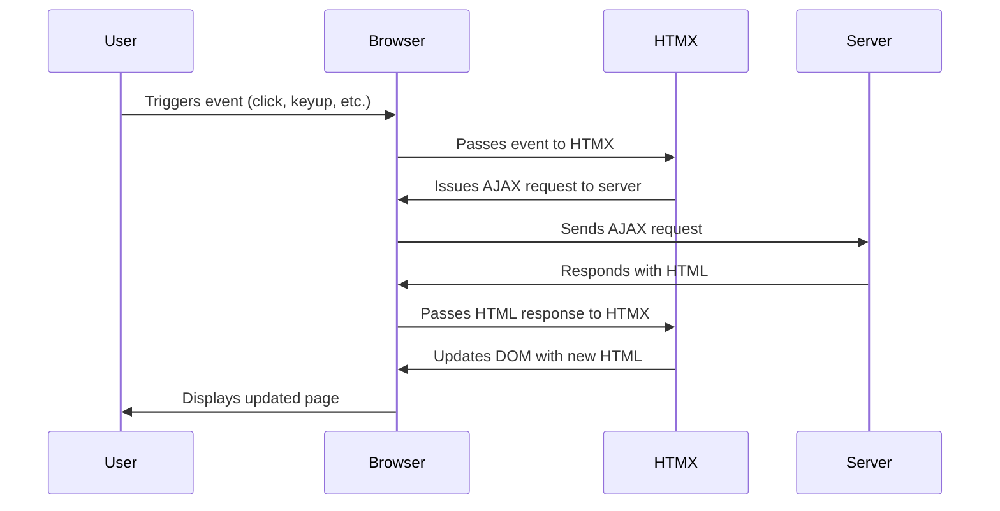

 

## What is HTMX?

HTMX stands for "HTML Extension". It's a library that allows you to access modern browser features directly from HTML, rather than using JavaScript. With HTMX, you can update parts of your web page without reloading the whole thing. It's based on similar concept as hotwire or livewire are. Let's see how it works, 




1. The user triggers an event (like a click or keyup) in the browser.  
2. The browser passes this event to HTMX.  
3. HTMX issues an AJAX request to the server.  
4. The server responds with HTML.  
5. HTMX updates the DOM with the new HTML.  
6. The browser displays the updated page to the user.

## Setting Up Your Laravel Project

Let's start by creating a playground for our project. We'll use Laravel, which is a powerful web development framework. Let's setup this with Laravel breeze.

### Installing HTMX

First, we need to get HTMX into our project. You can think of it as getting a new tool for your toolbox. We'll show you how to do this using npm (a package manager) or by simply including HTMX from a Content Delivery Network (CDN).

![[SCR-20230906-krgk.jpeg]]


Run following command to add, contact model, migration and a controller. 

```shell
php artisan make:model Contact --controller --migration
```


Update routes file with 

```php
Route::resource('contacts', ContactController::class);
```

Create view for the contacts, let's create index.blade.php first.

**resources**
└── **views**
    └── **contacts**
        └── **partials**
            ├── form.blade.php
              |── table.blade.php
            ├── table-row.blade.php
            └── show.blade.php
            **index.blade.php**

Let's write a very basic crud application in traditional style, and then see how we can use HTMX to make it livewired or ajax buddy. 

Let's start with controller,

```php
<?php  
  
namespace App\Http\Controllers;  
  
use App\Models\Contact;  
use Illuminate\Http\Request;  
  
class ContactController extends Controller  
{  
    public function index(Request $request)  
    {  
        $contacts = Contact::all();   
        
        return view('contacts.index', compact('contacts'));  
    }  
  
    public function create()  
    {  
        return view('contacts.partials.form')->render();  
    }  
  
    public function store(Request $request)  
    {  
        $request->validate([  
            'name' => ['required', 'string', 'max:255'],  
            'email' => ['required', 'email', 'max:255'],  
        ]);  
  
        Contact::create($request->all());  
  
        return redirect()->route('contacts.index');
    }  
  
    public function show(string $id)  
    {  
        return view('contacts.partials.show', ['contact' => Contact::find($id)]);  
    }  
  
    public function edit(string $id)  
    {  
        return view('contacts.partials.form', ['contact' => Contact::find($id)])->render();  
    }  
  
    public function update(Request $request, string $id)  
    {  
        $contact = Contact::find($id);  
  
        $contact->fill($request->all());  
  
        $contact->save();  
  
        return redirect()->route('contacts.index');  
    }  
  
    public function destroy(string $id)  
    {  
        Contact::destroy($id);  

		return redirect()->route('contacts.index');
    }  
}
```

And in views **index.blade.php**,

```php
 <x-app-layout>  
    <x-slot name="header">  
        <h2 class="font-semibold text-xl text-gray-800 leading-tight">  
            {{ __('Contacts') }}  
        </h2>  
    </x-slot>  
  
    <div class="py-12">  
       
        <div class="max-w-7xl mx-auto sm:px-6 lg:px-8">  
  
            <div id="contact-details"  
                class="bg-white overflow-hidden shadow-sm sm:rounded-lg mb-3">  
            </div>  
  
            <div class="flex w-full mb-2" style="justify-content: end">   
                <x-primary-button>
                {{ __('Create New Contact') }}
                </x-primary-button>    
            </div>  
              
            <div class="bg-white overflow-hidden shadow-sm sm:rounded-lg">  
                   @include('contacts.partials.table')  
            </div>  
        </div>  
    </div>  
    
</x-app-layout>
```

**table.blade.php**

```php
<table id="contacts-table" class="table-auto w-full"  hx-get="/contacts?table" hx-trigger="newContact from:body">  
    <thead>  
        <tr>  
            <th class="px-4 py-2 border text-left">Name</th>  
            <th class="px-4 py-2 border text-left">Email</th>  
            <th class="px-4 py-2 border text-left">Phone</th>  
            <th class="px-4 py-2 border text-left">Address</th>  
            <th class="px-4 py-2 border text-left">Actions</th>  
        </tr>  
    </thead>  
    <tbody id="contacts-table-body">  
            @each('contacts.partials.table-row', $contacts, 'contact')  
    </tbody>  
</table>
```

**table-row.blade.php**

```php

<tr id="contact-{{ $contact->id }}">  
    <td class="px-4 py-2 border">{{ $contact->name }}</td>  
    <td class="px-4 py-2 border">{{ $contact->email }}</td>  
    <td class="px-4 py-2 border">{{ $contact->phone }}</td>  
    <td class="px-4 py-2 border">{{ $contact->address }}</td>  
    <td class="px-4 py-2 border ">  
        <a href="#" class="mr-1 uppercase hover:underline">View</a>  
        <a href="#" class="mr-1 uppercase hover:underline">Edit</a>  
        <a href="#" class="mr-1 uppercase hover:underline">Delete</a>  
    </td>  
  </tr>  
```

**form.blade.php**
```php
<form class="mt-6 space-y-5 p-5">  
  @csrf <div>  
    <x-input-label for="name" :value="__('Name')" />  
    <x-text-input id="name" name="name" type="text" class="mt-1 block w-full" :value="old('name', isset($contact) ? $contact->name : null)" required autofocus autocomplete="name" />  
    <x-input-error class="mt-2" :messages="$errors->get('name')" />  
</div>  
  
<div>  
    <x-input-label for="email" :value="__('Email')" />  
    <x-text-input id="email" name="email" type="email" class="mt-1 block w-full" :value="old('email', isset($contact) ? $contact->email : null)" required />  
    <x-input-error class="mt-2" :messages="$errors->get('email')" />  
</div>  
  
 <div>  
    <x-input-label for="phone" :value="__('Phone')" />  
    <x-text-input id="phone" name="phone" type="text" class="mt-1 block w-full" :value="old('phone', isset($contact) ? $contact->phone : null)" required />  
    <x-input-error class="mt-2" :messages="$errors->get('phone')" />  
</div>  
  
<div>  
    <x-input-label for="address" :value="__('Address')" />  
    <x-text-input id="address" name="address" type="text" class="mt-1 block w-full" :value="old('address', isset($contact) ? $contact->address : null)" required />  
    <x-input-error class="mt-2" :messages="$errors->get('address')" />  
</div>  
  
<div class="flex items-center gap-4">  
  <x-primary-button>{{ __('Save') }}</x-primary-button>    
  <x-secondary-button>{{ __('Cancel') }}</x-secondary-button>  
</div>   
</form>
```

**show.blade.php**
```php
<div class="p-5">  
  <h2 class="text-2xl font-bold">{{ $contact->name }}</h2>  
  <p class="text-gray-600">Email: {{ $contact->email }}</p>  
  <p class="text-gray-600">Phone: {{ $contact->phone }}</p>   
  <p class="text-gray-600">Address: {{ $contact->address }}</p>             
</div>
```