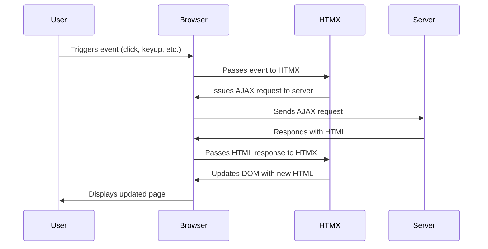

 

## What is HTMX?

HTMX stands for "HTML Extension". It's a library that allows you to access modern browser features directly from HTML, rather than using JavaScript. With HTMX, you can update parts of your web page without reloading the whole thing. It's based on similar concept as hotwire or livewire are. Let's see how it works, 

1. The user triggers an event (like a click or keyup) in the browser.  
2. The browser passes this event to HTMX.  
3. HTMX issues an AJAX request to the server.  
4. The server responds with HTML.  
5. HTMX updates the DOM with the new HTML.  
6. The browser displays the updated page to the user.

## Setting Up Your Laravel Project

Let's start by creating a playground for our project. We'll use Laravel, which is a powerful web development framework. Let's setup this with Laravel breeze.

### Installing HTMX

First, we need to get HTMX into our project. You can think of it as getting a new tool for your toolbox. We'll show you how to do this using npm (a package manager) or by simply including HTMX from a Content Delivery Network (CDN).
![[SCR-20230906-krgk.jpeg]]

### Basic Configuration and Project Structure

Once HTMX is in, we'll take a look at some basic setup stuff. Think of it as making sure all the pieces are in the right place before we start building.

By the end of this episode, you'll have a Laravel project with HTMX ready to go. It's like setting up your workbench before you start crafting something amazing.

Stay tuned for the next episode, where we'll dive deeper into how HTMX works!

Remember, we're here to help you every step of the way. No question is too small, and there's no rush. Let's enjoy this learning journey together!

 